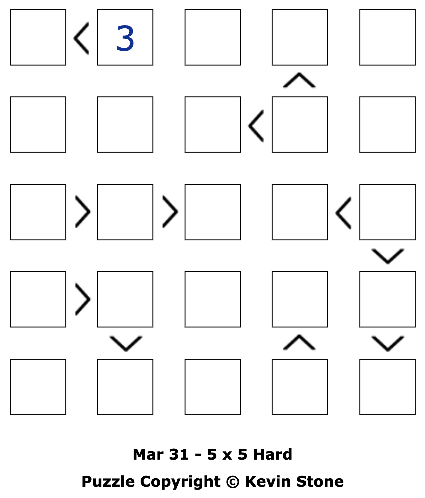

# futoshiki-pl-solver
A solver for Futoshiki inequality puzzles.

## Futoshiki puzzles

Futoshiki puzzles are a Japanese puzzle game where the puzzle grids are Latin squares with in-built inequalities spanning cells. For example, the following 5x5 puzzle



has the constraint that row one, column one ($R1C1$) is strictly less than the adjacent cell to the right; i.e., $R1C1 < R1C2 \equiv R1C1 < 3 \Rightarrow R1C1 \in \{1, 2\}$. The puzzles can therefore be framed as finite domain constraint problems, making them perfect candidates for Prolog and the CLP(FD) library.

## Usage

Define a grid (list of lists of $n\times n$ size) and fill in the given digits. Next, list all inequalities in the puzzle as a list, where each inequality is of the form `(R1,C1)<(R2,C2)` or `(R1,C1)>(R2,C2)`. Then, call `solve_futoshiki/2`. For example, the above $5\times5$ puzzle can be specified as:

```prolog
?- Grid = [
 [_, 3, _, _, _],
 [_, _, _, _, _],
 [_, _, _, _, _],
 [_, _, _, _, _],
 [_, _, _, _, _]
],
Constraints = [
 (1,1)<(1,2),
 (2,4)>(2,3), (2,4)>(1,4),
 (3,1)>(3,2), (3,2)>(3,3), (3,5)>(3,4), (3,5)>(4,5), (4,5)>(5,5),
 (4,1)>(4,2), (4,2)>(5,2),
 (5,4)>(4,4)
],
solve_futoshiki(Grid, Constraints),
write(Grid).
```

Which produces the output

```
[
 [1,3,5,2,4],
 [2,5,3,4,1],
 [4,2,1,3,5],
 [5,4,2,1,3],
 [3,1,4,5,2]
]
```

If specifying the entire grid is too laborious, you can specify a matrix and use the included `nth1_matrix(+Row, +Column, +Matrix, ?CellValue)` predicate to describe the puzzle:

```prolog
length(Grid, 5),
maplist(same_length(Grid), Grid), % 5x5 puzzle
nth1_matrix(1, 2, Grid, 3),
Constraints = [
 (1,1)<(1,2),
 (2,4)>(2,3), (2,4)>(1,4),
 (3,1)>(3,2), (3,2)>(3,3), (3,5)>(3,4), (3,5)>(4,5), (4,5)>(5,5),
 (4,1)>(4,2), (4,2)>(5,2),
 (5,4)>(4,4)
],
solve_futoshiki(Grid, Constraints),
write(Grid).
```

## Performance

The solver uses the CLP(FD) library, which employs constraint propagation to yield fairly efficient performance. For the following $9\times9$ puzzle, Prolog produces an answer in $\approx 0.055 \text{s}$:

```prolog
?- Grid = [
 [_, _, _, 7, _, _, _, _, _],
 [_, 7, _, _, _, _, _, _, _],
 [1, _, _, 2, _, _, _, _, 6],
 [_, _, _, _, _, _, _, _, _],
 [_, _, _, _, _, 9, _, _, 7],
 [_, _, _, 1, _, 5, _, _, _],
 [_, _, _, _, _, _, _, _, _],
 [9, _, _, 3, _, _, _, _, _],
 [_, _, _, _, _, _, _, _, _]
],
Constraints = [
 (1,4)>(2,4), (2,4)>(2,3),
 (1,9)>(2,9), (2,9)>(2,8),
 (2,5)<(2,6), (2,6)>(3,6), (3,6)>(3,7), (3,7)<(4,7),
 (3,8)>(3,9),
 (4,2)>(4,3),
 (4,5)>(4,4), (4,4)<(5,4), (5,4)<(5,3), (5,3)>(6,3),
 (5,1)>(6,1), (6,1)>(7,1),
 (6,8)<(5,8), (5,8)>(5,9), (5,9)>(6,9),
 (6,2)>(7,2), (7,2)>(7,3), (7,2)>(8,2), (8,2)>(8,3),
 (7,5)<(7,6), (7,6)>(8,6), (8,6)>(9,6),
 (7,7)<(7,8), (7,8)<(8,8), (8,8)<(8,7), (8,7)<(9,7), (8,8)>(8,9),
 (9,8)<(9,9)
],
solve_futoshiki(Grid, Constraints),
write(Grid).

 8 1 9 7 2 3 4 6 5
 5 7 1 6 4 8 9 2 3
 1 5 8 2 7 4 3 9 6
 7 9 3 4 6 2 5 1 8
 4 3 6 5 1 9 2 8 7
 3 8 4 1 9 5 6 7 2
 2 6 5 8 3 7 1 4 9
 9 4 2 3 8 6 7 5 1
 6 2 7 9 5 1 8 3 4
```
